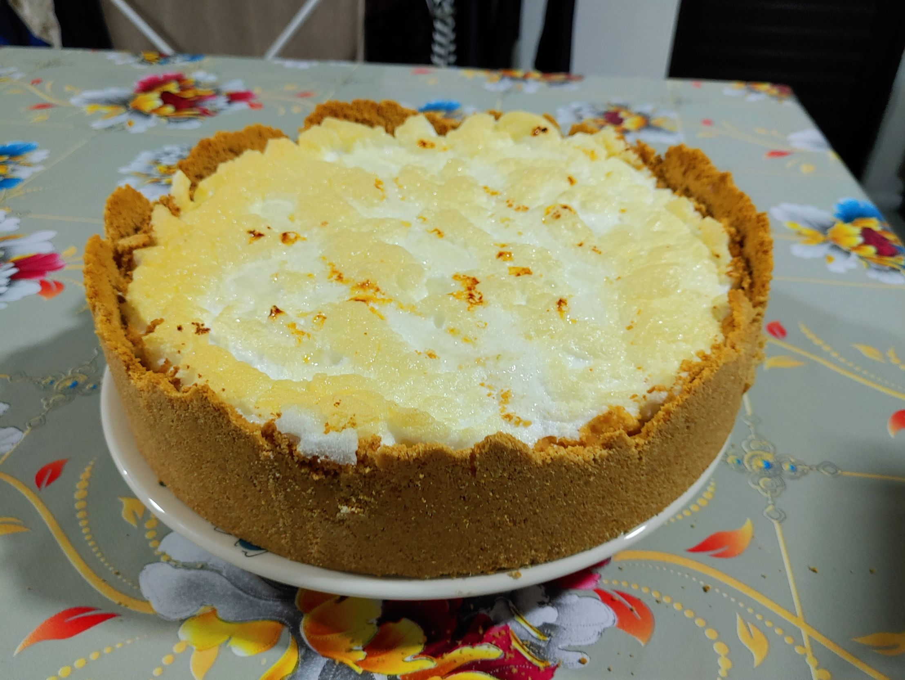
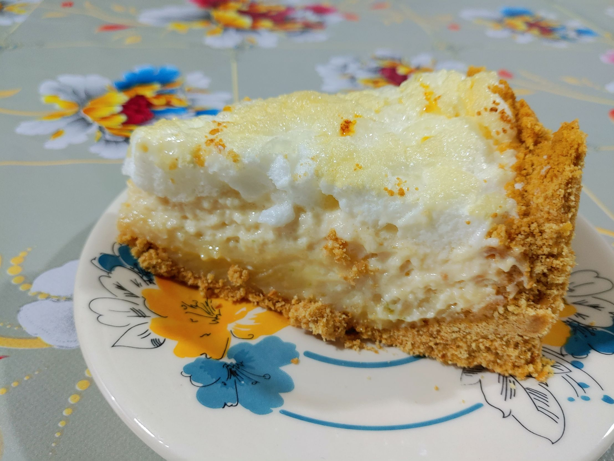

# Torta de limão com chocolate branco

Esta receita veio da minha mãe e é espetacular. Ela é preparada em 4 etapas: a massa, o ganache, o mousse e a cobertura.

## Ingredientes

A seguir, a lista de ingredientes, separados por etapa.

### Massa

- 4 pacotes de bolacha de leite
- 200g de manteiga sem sal em temperatura ambiente
- Forma redonda de fundo falso

### Ganache de limão com chocolate branco

- 200g de chocolate branco
- 1/2 lata de creme de leite sem soro
- 1/4 xícara de suco de limão
- Raspas de limão

### Mousse de limão

- 1 lata de leite condensado
- 1/2 lata de creme de leite com soro
- 1/2 xícara de suco de limão
- Clara em neve de 2 ovos
- 1 colher de sopa rasa de gelatina incolor sem sabor

### Cobertura

- Clara em neve de 2 ovos
- Suco de 1 limão
- 1 colher de amido de milho
- Raspas de limão

## Preparação da massa

Primeiro vamos preparar a massa de bolacha. Para isso vamos precisar moer 4 pacotes de bolacha de leite num processador ou liquidificador, até virar uma farinha.

Então, misture com a manteiga usando as mãos. O objetivo é atingir uma mistura moldável: se você apertar a farinha na sua mão, ela vai ficar moldada daquele jeito quando abrir. Esse é o ponto.

Basta então despejar a mistura na forma, cobrindo o fundo, e moldando as bordas, sempre cuidando para não fazer as bordas muito espessas, ou então vai ficar quebradiço na hora de cortar.

Uma vez moldado, leve ao forno pré-aquecido em 180ºC por quinze minutos e reserve.

## Preparação do ganache

Nesta receita, o ganache é usado como recheio, e vai por baixo do mousse de limão.

Primeiro, derreta o chocolate branco em banho maria. Uma vez bem derretido, misture o creme de leite sem soro, de preferência usando uma espátula de silicone.

Depois, misture o suco e as raspas de limão, e reserve.

## Preparação do mousse

Dissolva 1 colher da gelatina em 4 colheres de água fria, e bata no liquidificador junto com os outros ingredientes do mousse, exceto a clara em neve. Vale adicionar o suco de limão por último para evitar de talhar.

Despeje a mistura numa bacia, e misture com a clara em neve com leveza, com uma colher ou espátula, até a mistura ficar homogênea, e reserve.

## Montagem da torta

Despeje o ganache sobre a massa. Deve ser suficiente para cobrir todo o fundo da torta. Distribua bem e leve para a geladeira por 5 minutos.

Com o ganache levemente endurecido, despeje agora o mousse e espalhe bem.

Prepare a clara em neve da cobertura, e espalhe por cima. É importante não bater demais a clara, para que seja mais fácil de moldá-la em cima da torta. Deta forma, você pode fazer pequenos picos usando uma colher.

## Preparação da cobertura

O toque final é opcional, mas faz uma diferença no resultado final.

Numa panela, reduza o suco do limão com uma colher de sopa bem cheia de açúcar. Quando estiver bem reduzido, adicione uma colher de amido de milho dissolvida com uma colher de água, e misture até engrossar.

Espalhe esse molho sobre a clara em neve da cobertura. Salpique as raspas de limão.

## Tratamento estético

Leve de volta ao forno pré-aquecido em 180ºC configurado para dourar, e aguarde alguns minutos, até as pontas da clara em neve dourarem.

É essa etapa que dá o acabamento final à torta, e faz com que se destaque.

## Resultado final

